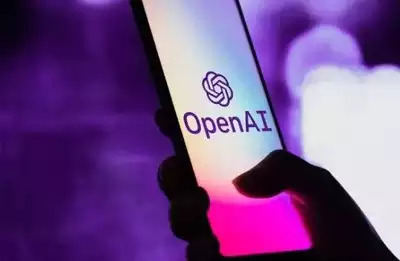

**Do you find yourself wanting to use ChatGPT for everything?** 

Consider again! 

ChatGPT is a powerful AI tool that can assist you with certain tasks, but it can also impair your thinking, analytical, and creative abilities over time. 

This is why:

- ### _"Education is not just about finding the right answers to questions in your textbooks but internalising the concepts and learning how to apply them in real-world"_

    - ChatGPT is not a replacement for learning. It can generate text based on keywords, but it has no understanding of the actual meaning & context. 

    - It can tell you the answers your questions from the internet but it can't educate you. If you rely solely on ChatGPT for your education & research, you will miss out on learning how to research about a topic, scour through books, internet and learn from experts.

- ### _"Googling is an art"_
    - ChatGPT is not a replacement for thinking. It can generate coherent sentences, but there is no logic or reasoning behind them. 

    - It is not capable of analysing problems and making decisions out of them. You lose your ability to think critically and analyse things when you expect ChatGPT to give a direct answer.

    - You learn when you try different solutions to a problem and analyse the outcomes. And most often than not, there's no _one size fits all_ for our problems.
 
- ### _"Art is an expression of our thoughts, emotions, intuitions, and desires"_

    - ChatGPT is not a replacement for creating. It can mimic different styles and formats, but it lacks originality and personality. 

    - It is cannot express your voice, vision, emotions and personality. Once invests time to learn a craft like writing, drawing, painting. Once attaiining a level of skill, one learns to express himself through his craft. 
    - You never learn a craft to create something unique and meaningful if you rely on ChatGPT for your writing or art.

Don't let ChatGPT rob you off the unique skills that separate humans and AI-machines! Use it sparingly and always double-check its output for accuracy and quality. Keep in mind that nothing can ever replace your own brain and creativity!

_**This blog was generated & paraphrased using ChatGPT_