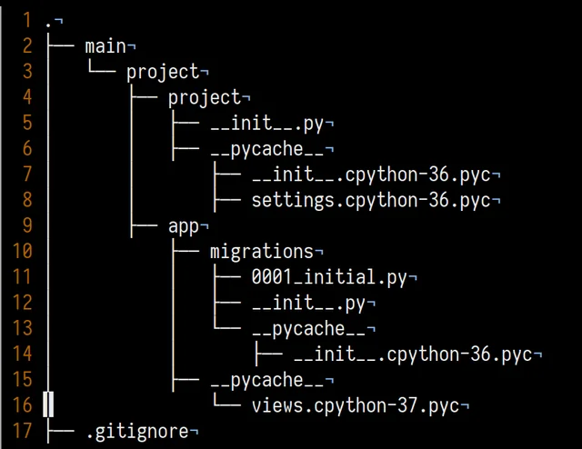

If you’ve been diving into Python, you might have stumbled upon a curious directory called `__pycache__`. Let’s demystify it a bit!

*Image source: Reddit*

### What is `__pycache__`?
Simply put, `__pycache__` is a special folder created by Python. It stores the compiled bytecode files (those ending with `.pyc`) of your scripts. These are optimized versions of your code, meant to speed up the execution process.

### Why is it used?
The main reason for `__pycache__` is to boost the performance of your Python programs. When you run a Python script, it gets compiled into bytecode. By storing these bytecode files, Python can skip recompiling on subsequent runs, leading to faster startup times.

### What about its naming convention?
Inside `__pycache__`, you’ll find `.pyc` files with names like `module_name.cpython-version.pyc`. This structure ensures compatibility across different Python versions. For instance, `example.cpython-39.pyc` means it was compiled with CPython version 3.9. There are other Python distributions specific for different use-cases:

- **CPython**
CPython is the Python reference implementation, the standard version that all other Python incarnations look to. CPython is written in C, as implied by the name, and is produced by the same core group of people responsible for making top-level decisions about the Python language.

- **Anaconda Python**
Anaconda, produced by Anaconda Inc. (formerly Continuum Analytics), is designed for Python developers who need a distribution backed by a commercial provider and with support plans for enterprises. The chief use cases for Anaconda Python are math, statistics, engineering, data analysis, machine learning, and related applications.

- **ActiveState Python**
Like Anaconda, ActiveState Python is created and maintained by a for-profit company—in this case, ActiveState, which markets a number of language runtimes along with the multi-language Komodo IDE.

- **PyPy**
A drop-in replacement for the CPython interpreter, PyPy uses JIT compilation to speed up the execution of Python programs. Depending on the task, the performance gains can be dramatic. 

and many more. 

### When does it get created?
`__pycache__` pops up automatically when you run a Python script that imports another module. If you’re running a standalone file, it doesn’t show up. If the relevant `.pyc` files don’t exist yet, or if the source file has changed since the last run, Python will compile the source code and store the bytecode in `__pycache__`.

### Should You Delete __pycache__?
You may wonder whether it's safe to delete the "__pycache__" folder. In most cases, it's entirely safe, as Python will recreate it as needed.

However, there are some scenarios where you might want to keep it:

- **Development**: During development, it's convenient to keep "__pycache__" to benefit from faster module imports. Deleting it won't harm your code, but it might slow down imports temporarily until Python recreates the bytecode files
- **Deployment**: When deploying your Python code, you can safely omit the "pycache" folder. It won't affect your production environment, and it can save space.

So, `__pycache__` is a behind-the-scenes helper in Python that enhances the performance and compatibility of your code. It automatically stores compiled bytecode, making your Python programs run faster.